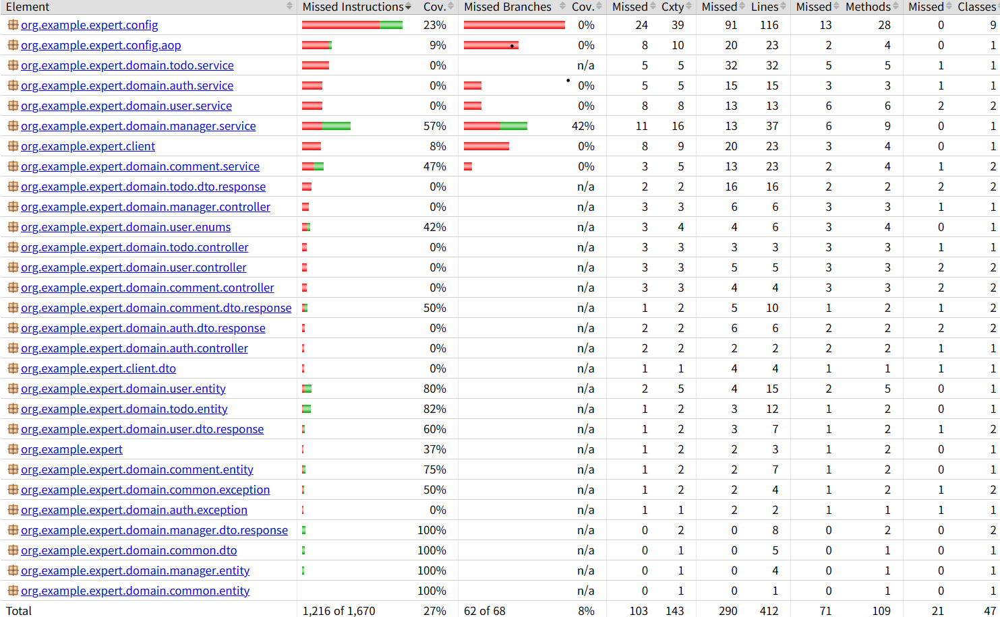

# CRUD 개선 및 테스트 코드

### 프로젝트 소개

- 1 ~ 3단계 필수 기능 4 ~ 6단계 도전 기능의 각 요구사항에 따라 일정 관리 앱을 만든 프로젝트입니다.
---
### 프로젝트 목적
- Spring 심화 학습 후, Spring 실습과 코드 개선(N + 1문제, API 로깅 등), 테스트 코드 연습을 목적으로 작성하였습니다.
---
### 개발 기간
- 25.06.05 ~ 25.06.12
---
### 프로젝트 요구사항
- 필수 기능
   - Lv 1. 코드 개선

      - Early Return
         - 조건에 맞지 않는 경우 즉시 리턴하여, 불필요한 로직의 실행을 방지하고 성능을 향상시킵니다.
         - 패키지 package org.example.expert.domain.auth.service; 의 AuthService 클래스에 있는 signup() 중 아래의 코드 부분의 위치를 리팩토링해서
           에러가 발생하는 상황일 때, passwordEncoder의 encode() 동작이 불필요하게 일어나지 않게 코드를 개선해주세요.
      - 불필요한 if-else 피하기
         - 복잡한 if-else 구조는 코드의 가독성을 떨어뜨리고 유지보수를 어렵게 만듭니다. 불필요한 else 블록을 없애 코드를 간결하게 합니다.
           패키지 package org.example.expert.client; 의 WeatherClient 클래스에 있는 getTodayWeather() 중 아래의 코드 부분을 리팩토링해주세요.
      - Validation
         - 패키지 package org.example.expert.domain.user.service; 의 UserService 클래스에 있는 changePassword() 
           중 아래 코드 부분을 해당 API의 요청 DTO에서 처리할 수 있게 개선해주세요.
           
   - Lv 2. N+1 문제

      - TodoController와 TodoService를 통해 Todo 관련 데이터를 처리합니다.
      - 여기서 N+1 문제가 발생할 수 있는 시나리오는 getTodos 메서드에서 모든 Todo를 조회할 때, 
        각 Todo와 연관된 데이터를 개별적으로 가져오는 경우입니다.
      - 요구사항:
         - JPQL fetch join을 사용하여 N+1 문제를 해결하고 있는 TodoRepository가 있습니다. 
           이를 동일한 동작을 하는 @EntityGraph 기반의 구현으로 수정해주세요.
              
   - Lv 3. 테스트코드 연습

      - 테스트 패키지 package org.example.expert.config; 의 PassEncoderTest 클래스에 있는 matches_메서드가_정상적으로_동작한다() 
        테스트가 의도대로 성공할 수 있게 수정해 주세요.
      - 테스트 패키지 package org.example.expert.domain.manager.service; 의 ManagerServiceTest 의 클래스에 있는 
        manager_목록_조회_시_Todo가_없다면_NPE_에러를_던진다() 테스트가 성공하고 컨텍스트와 일치하도록 테스트 코드와 테스트 코드 메서드 명을 수정해 주세요.
      - 테스트 패키지 org.example.expert.domain.comment.service; 의 CommentServiceTest 의 클래스에 있는 
        comment_등록_중_할일을_찾지_못해_에러가_발생한다() 테스트가 성공할 수 있도록 테스트 코드를 수정해 주세요.
      - 테스트 패키지 org.example.expert.domain.manager.service의 ManagerServiceTest 클래스에 있는 
        todo의_user가_null인_경우_예외가_발생한다() 테스트가 성공할 수 있도록 서비스 로직을 수정해 주세요.
              
- 도전 기능
   - Lv 4. API 로깅

      - Interceptor와 AOP를 활용한 API 로깅
         -  키워드 : Interceptor 또는 AOP를 활용합니다.
         -  어드민 사용자만 접근할 수 있는 특정 API에는 접근할 때마다 접근 로그를 기록해야 합니다.
      -  요구사항:
         -  어드민 사용자만 접근할 수 있는 컨트롤러 메서드는 다음 두 가지예요.
           - org.example.expert.domain.comment.controller.CommentAdminController 클래스의 deleteComment()
           - org.example.expert.domain.user.controller.UserAdminController 클래스의 changeUserRole()
      -  로깅 구현 방법:
         -  Interceptor를 사용하여 구현하기
           - 요청 정보(HttpServletRequest)를 사전 처리합니다.
           - 어드민 권한 여부를 확인하여 인증되지 않은 사용자의 접근을 차단합니다.
           - 인증 성공 시, 요청 시각과 URL을 로깅하도록 구현하세요.
         - AOP를 사용하여 구현하기
           - 어드민 API 메서드 실행 전후에 요청/응답 데이터를 로깅합니다.
           - 로깅 내용에는 다음이 포함되어야 합니다:
             - 요청한 사용자의 ID
             - API 요청 시각
             - API 요청 URL
             - 요청 본문(RequestBody)
             - 응답 본문(ResponseBody)
         - 세부 구현 가이드
           - Interceptor:
             - 어드민 인증 여부를 확인합니다.
             - 인증되지 않은 경우 예외를 발생시킵니다.
           - AOP:
             - @Around 어노테이션을 사용하여 어드민 API 메서드 실행 전후에 요청/응답 데이터를 로깅합니다.
             - 요청 본문과 응답 본문은 JSON 형식으로 기록하세요.
           - 로깅은 Logger 클래스를 활용하여 기록합니다.
            
   - Lv 5. 위 제시된 기능 이외 ‘내’가 정의한 문제와 해결 과정

      - 1. 코드를 꼼꼼하게 살펴보고, 개선 가능성이 있는 문제를 선정합니다.
      - 2. 문제를 정의합니다.
      - 3. 해결 과정을 기록합니다.
      - 4. 해결 후 회고를 진행해, 어떤 부분이 나아졌는지 문서로 남깁니다.
              
   - Lv 6. 테스트 커버리지

      - 테스트 코드 커버리지는 README.md에 이미지로 첨부해주세요
         - 테스트 커버리지의 종류
         - 테스트 커버리지는 종류가 많이 있지만, 일반적으로 아래 두가지를 중점적으로 확인해요.
           - Line Coverage
             - Line Coverage는 테스트가 소스 코드의 몇 퍼센트를 실행했는지를 측정하는 지표예요.
             - 코드를 한 번이라도 실행하면 해당 라인은 커버된 것으로 간주돼요.
             - 이 커버리지를 통해 테스트가 코드의 각 부분을 얼마나 많이 잘 다루고 있는지 파악할 수 있어요.
           - Condition Coverage
             - Condition Coverage는 개별 조건식이 참과 거짓으로 평가되는 경우를 모두 테스트했는지를 측정하는 지표예요.
               (즉, 조건문 안에 있는 모든 조건들이 각각 독립적으로 테스트되어야 한다는 뜻이에요.)
             - 복합 조건이 있는 경우 각 서브 조건이 독립적으로 테스트되어야 해요.
               (예를 들어, 조건문 (A && B)가 있을 때, A와 B 각각이 참과 거짓인 경우를 모두 테스트하는 것이 목표예요.)
             - intelliJ에서 테스트 작성률 확인하기
               - 테스트 코드를 실행할 때 Run with Coverage를 사용해서 실행하세요.
               - 커버리지 탭을 사용해서 어느 정도의 커버리지 퍼센티지를 가지고 있는지 확인해보세요.
             - intelliJ를 활용한 테스트 커버 여부 확인 방법
               - Run with Coverage 실행 후 실제 소스 코드에 가면 왼쪽에 초록/빨강 색상을 보실 수 있어요.
               - 초록색은 테스트가 실행된 코드 줄을 나타내고, 빨간색은 테스트되지 않은 코드 줄을 나타냅니다.
               - 이를 통해 테스트되지 않은 부분을 찾아 보완할 수 있어요.
                    

---      
### 테스트 커버리지

---
### 개발 환경
- IDE : IntelliJ, JDK : 17.0.10 버전 사용

---
### 사용된 기술
- 언어 : JAVA
- 프레임워크 : SpringBoot
